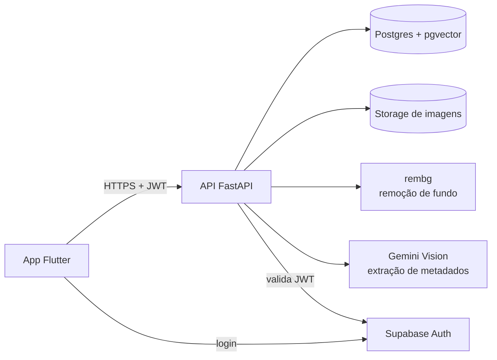

# Documento de Arquitetura — Guarda-Roupa Virtual

Este documento é a referência completa de arquitetura, com o racional por trás das decisões. O [CLAUDE.md](../CLAUDE.md) na raiz do repositório é o resumo operacional — direcionado a quem (ou ao Claude Code) está escrevendo código no dia a dia — e assume tudo que está aqui como pano de fundo. Quando os dois divergirem, este documento é a fonte de verdade sobre o "porquê"; o CLAUDE.md sobre o "como, agora".

## Visão geral



Três peças se comunicam: o **app Flutter** (cliente), a **API FastAPI** (toda a regra de negócio e orquestração de IA vive aqui, nunca no cliente) e o **Postgres com pgvector** (dados relacionais + busca por similaridade de estilo). Autenticação é delegada ao Supabase Auth — a API nunca gerencia senha, só valida o token que o Supabase emitiu.

## Stack e racional de cada escolha

| Camada | Tecnologia | Por que essa e não outra |
| --- | --- | --- |
| Mobile | Flutter (Dart) | Um único código-fonte para iOS e Android, acesso nativo à câmera (essencial pro cadastro de peças). |
| Backend | FastAPI (Python 3.11+) | Assíncrono nativo (importante porque a API orquestra chamadas de IA que são naturalmente I/O-bound), tipagem via Pydantic reduz bugs de contrato entre mobile e API, e é o ecossistema mais direto pra integrar bibliotecas de visão computacional (rembg, clientes de modelos de IA). |
| Banco | PostgreSQL + `pgvector` | Postgres é relacional maduro e já resolve 90% do domínio (peças, looks, preferências). `pgvector` evita introduzir um banco vetorial separado (Pinecone, Weaviate) só para a feature de inspiração por imagem — um banco a menos para operar. |
| ORM / migrações | SQLAlchemy 2.0 + Alembic | Tipagem explícita (`Mapped`/`mapped_column`) e migrações versionadas — mudança de schema nunca é feita à mão no banco. |
| Auth | Supabase Auth | Gerenciar senha, recuperação de conta e sessão é um domínio inteiro por si só; terceirizar isso deixa a equipe focada no produto. Ver "Banco em produção" abaixo — o mesmo projeto Supabase também hospeda o Postgres de produção. |
| Visão computacional | `rembg` + Gemini Vision | `rembg` remove fundo localmente, sem custo de API por imagem. Gemini Vision faz o trabalho mais caro (entender a peça e sugerir metadados), mas a sugestão é sempre revisável pelo usuário antes de salvar — nunca é verdade final. |
| Storage de imagens | Local (MVP) → S3/Supabase Storage (produção) | Ver seção "Storage" abaixo. |
| Ambiente local | Docker Compose | Sobe Postgres com `pgvector` idêntico ao que existe em produção, sem exigir instalação nativa do Postgres na máquina de cada dev. |

## Arquitetura em camadas do backend

```
routers/   (app/api/v1/)  → HTTP, validação Pydantic, dependência de auth
services/                 → regras de negócio (orquestra os adapters)
adapters/                 → rembg, Gemini, storage — cada um atrás de uma interface própria
models/    (app/db/)      → SQLAlchemy 2.0
schemas/                  → Pydantic, separados dos models
```

Regra estrita: **um router nunca chama `rembg` ou Gemini diretamente** — sempre chama um service, que por sua vez chama os adapters. Isso existe porque os adapters são as peças com maior chance de troca (ex: sair do storage local para S3, trocar Gemini por outro modelo de visão) e a troca não deve exigir tocar em nenhuma rota.

## Fluxos principais

### Cadastro de peça

1. App envia a foto para `POST /pecas/processar-imagem`.
2. API chama `rembg` para remover o fundo.
3. Imagem processada é salva no storage; a URL é devolvida.
4. Gemini Vision analisa a imagem e sugere metadados (categoria, cor, estação, ocasião).
5. Usuário revisa/corrige a sugestão no app e confirma com `POST /pecas` — a sugestão da IA nunca é salva sem revisão humana.

O passo 4 é entregue depois dos demais, de propósito: por decisão de produto, o cadastro nasce puramente manual (Épico 1 do [Documento de Requisitos](requisitos.md)) e só ganha a sugestão automática mais adiante (Épico 5), depois que a base do app já estiver funcionando sem depender de nenhuma IA.

Os passos 2–4 são lentos (chamadas de IA) e devem rodar fora do ciclo de request síncrono conforme o volume de usuários crescer — no MVP local, ainda são síncronos por simplicidade.

### Recomendação automática de looks

Motor de regras (não um modelo generativo) que filtra as peças cadastradas por ocasião/clima, aplica as preferências de estilo do usuário, e pontua priorizando peças menos usadas recentemente — para não sempre sugerir as mesmas favoritas. Ver [Documento de Requisitos](requisitos.md) para o épico correspondente.

### Inspiração por imagem

1. Usuário envia uma foto de referência externa.
2. Um modelo de visão gera um embedding de estilo dessa imagem.
3. `pgvector` busca, **entre as peças daquele usuário** (filtro por `usuario_id` é obrigatório — nunca uma busca global), as peças com embedding mais próximo.
4. Monta um look combinando essas peças; se não houver equivalente para alguma camada do look de referência, a resposta expõe a lacuna explicitamente em vez de inventar uma sugestão genérica.

## Modelo de dados

| Entidade | Status | Campos principais |
| --- | --- | --- |
| `Peca` | Implementada | `id`, `usuario_id`, `imagem_url`, `categoria`, `subcategoria`, `cor_principal`, `estacao`, `ocasiao`, `criado_em` |
| `Look` | Planejada | `id`, `usuario_id`, `nome`, `ocasiao`, `favorito`, `criado_em` + tabela associativa N:N com `Peca` |
| `Preferencia` | Planejada | `usuario_id` (chave única), cores favoritas, estilos preferidos, tolerância a sobreposição, peças evitadas, nível de criatividade |

A coluna de embedding (`vector`, via `pgvector`) entra em `Peca` só quando a feature de inspiração por imagem for implementada — decisão deliberada de não adicionar coluna não utilizada antes da hora.

## Ambiente de desenvolvimento vs produção

| | Desenvolvimento | Produção |
| --- | --- | --- |
| Banco | Postgres local via Docker Compose | Postgres gerenciado do mesmo projeto Supabase usado para Auth |
| Migrações | `alembic upgrade head` manual | Passo explícito do deploy, não automático no boot da API |
| Connection string | Direta (`localhost:5432`) | `DATABASE_URL` usa a conexão *pooled* do Supabase; `ALEMBIC_DATABASE_URL` usa a conexão direta (migrações nem sempre funcionam bem através do pooler) |
| Storage de imagens | Disco local (`backend/uploads/`) | S3 ou Supabase Storage |

O código da aplicação não muda entre os dois ambientes — só o valor das variáveis de ambiente (`DATABASE_URL`, etc.). Ver [README.md](../README.md) para os comandos de setup local.

## Decisões e trade-offs

- **Supabase para Auth *e* banco de produção, não dois provedores separados** — reduz a superfície operacional (um único projeto/dashboard cuidando de autenticação, banco e storage) às custas de um vendor lock-in leve, mitigado pelo fato de ser Postgres puro por baixo (dá pra migrar o banco pra outro provedor sem reescrever nada).
- **`pgvector` em vez de um banco vetorial dedicado** — suficiente para o volume de dados esperado no MVP; revisitar só se a escala de busca por similaridade justificar um banco especializado.
- **Storage local no MVP** — evita configurar credenciais de nuvem antes de precisar; a interface de `adapters/storage_adapter.py` já isola essa troca para quando for necessária.
- **Motor de recomendação baseado em regras, não em modelo generativo** — mais previsível, testável e barato que gerar sugestões via LLM a cada requisição; deixa a "inteligência" mais cara (Gemini Vision) reservada para os pontos onde ela é indispensável (extração de metadados, entendimento da imagem de inspiração).
